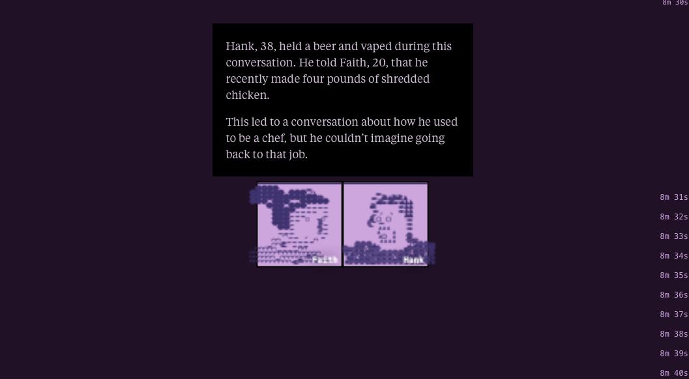

# Análisis de Webstory 
**Nombre:** Hello Stranger  
**Medio:** The Pudding  
**URL:** https://pudding.cool/2025/06/hello-stranger/

---

## 1. Descripción de la historia

"Hello Stranger" es una webstory interactiva que explora cómo las personas se relacionan con desconocidos en entornos digitales. A través de una experiencia conversacional simulada, el proyecto invita al usuario a interactuar con “extraños”, revelando patrones muy interesantes sobre comunicación, confianza y apertura en internet.

Más que presentar datos de forma explícita desde el inicio, la historia construye una experiencia inmersiva donde el usuario participa activamente. Solo después de interactuar aparecen visualizaciones y explicaciones que permiten interpretar lo vivido.

---

## 2. Estructura narrativa

La narrativa se organiza como una experiencia progresiva que desplaza el rol del usuario:

### a) Inmersión 
El usuario entra directamente en una interacción con un desconocido. 

### b) Participación 
La historia se construye a partir de las decisiones del usuario: responder, esperar, ignorar. 

### c) Aparición de los datos
Tras la experiencia, la webstory introduce visualizaciones que muestran patrones colectivos: tasas de respuesta, niveles de interacción, tiempos de espera. 

### d) Cierre 
La historia culmina abriendo preguntas más que cerrándolas: ¿qué buscamos al hablar con desconocidos? ¿conexión, validación, distracción?

---

## 3. Evaluación efectividad

Me parece que uno de los aspectos más interesantes de "Hello Stranger" es su dimensión crítica porque logra poner en evidencia una paradoja de la vida digital: estamos permanentemente conectados, pero esa conexión no necesariamente produce vínculos significativos. Las interacciones con desconocidos aparecen como intentos de conexión que muchas veces quedan en lo superficial, lo efímero o lo ambiguo.

Desde esta perspectiva, el proyecto dialoga con la idea de **soledad digital**: una forma de aislamiento que no implica ausencia de interacción, sino una saturación de contactos sin profundidad.

Además, creo que la webstory facilita la interacción, establecen tiempos, formatos y expectativas. En ese sentido, las conversaciones no son completamente libres, sino que están mediadas por algorítmicas.

Así, "Hello Stranger" no solo muestra datos sobre comunicación, sino que expone las tensiones entre:
- conexión vs. aislamiento  
- anonimato vs. identidad  
- espontaneidad vs. diseño de plataforma  

La webstory es efectiva en varios niveles:
- Convierte datos en experiencia vivida.
- Genera reflexión personal en el usuario.
- Integra forma y contenido de manera coherente.